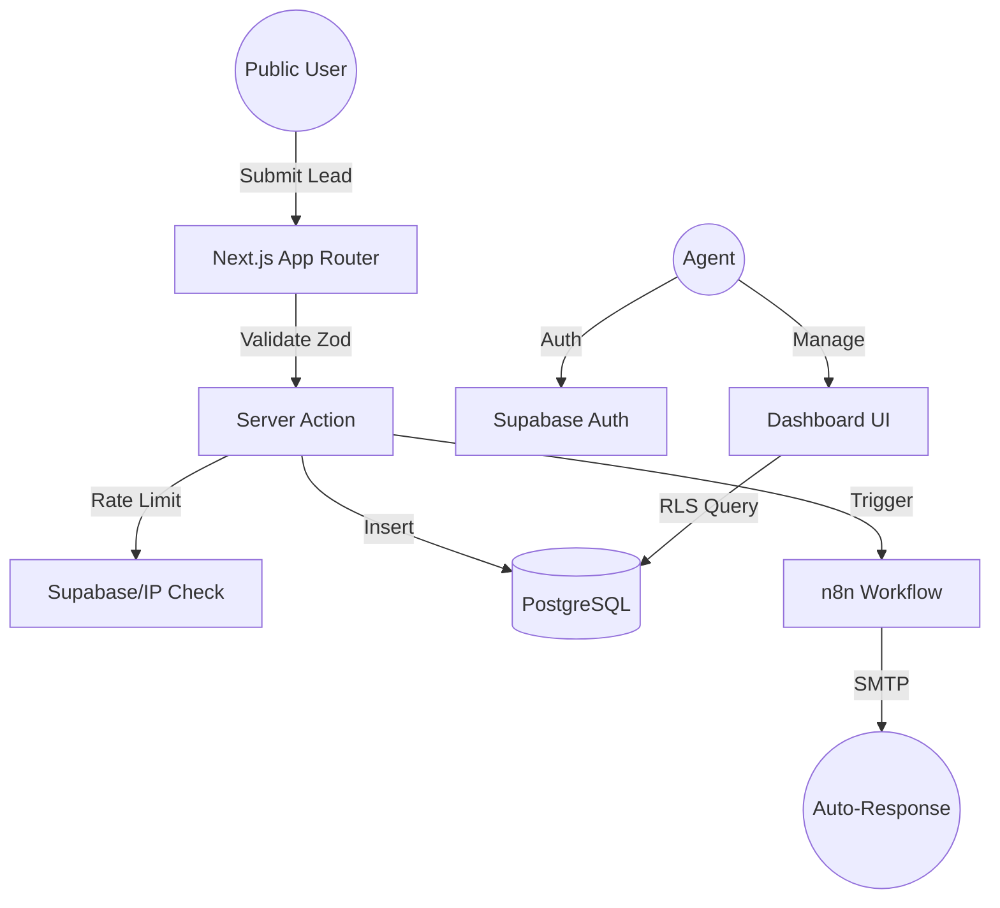

# Real Estate Lead Automation Platform

A production-grade, full-stack lead management system designed for real estate professionals. Built with **Next.js 15 (App Router)**, **Supabase**, and **n8n**, this platform streamlines lead capture and automates the follow-up lifecycle.


## 🚀 Overview

This project demonstrates a "Modern Noir" design aesthetic paired with a robust engineering architecture. It goes beyond simple CRUD operations by integrating a workflow orchestration layer for instant lead responses and scheduled CRM reminders.

### Key Features
- **Secure Lead Capture**: Public-facing form with server-side validation and rate-limiting.
- **Agent Command Center**: Role-based dashboard for managing the lead pipeline.
- **Workflow Orchestration**: n8n-driven automations for instant email triggers and follow-up alerts.
- **Production Security**: Strict Row Level Security (RLS) and session-based authentication via Supabase Auth.
- **Modern Tech Stack**: Next.js 15, Tailwind CSS 4.0, Shadcn/UI, and PostgreSQL.

---

## 🏗️ Architecture

The system follows a modular, server-side first architecture ensuring data integrity and security.



### Technical Decisions
- **Non-blocking Webhooks**: Automation triggers use a "fire-and-forget" pattern to ensure lead submission remains instantaneous for the end-user.
- **Row Level Security**: Database access is strictly controlled at the row level; agents only access leads assigned to their context.
- **Next.js 15 App Router**: Leverages Server Components and Server Actions for reduced client-side JavaScript and enhanced SEO.

---

## 🛠️ Tech Stack

- **Frontend**: Next.js 15, React 19, Tailwind CSS 4.0, Radix UI.
- **Backend**: Supabase (PostgreSQL, Auth, RLS).
- **Automation**: n8n (Self-hosted/Cloud).
- **Validation**: Zod.
- **Testing**: Vitest, Testing Library.

---

## 🚦 Getting Started

### 1. Database Setup
Execute the [supabase/schema.sql](./supabase/schema.sql) in your Supabase SQL Editor to initialize the tables, ENUMs, and RLS policies.

### 2. Environment Variables
Copy `.env.local.example` to `.env.local` and fill in:
```env
NEXT_PUBLIC_SUPABASE_URL=your_url
NEXT_PUBLIC_SUPABASE_ANON_KEY=your_key
SUPABASE_SERVICE_ROLE_KEY=your_service_key
N8N_WEBHOOK_URL=your_n8n_url
```

### 3. Install & Run
```bash
npm install
npm run dev
```

---

## 🔒 Security Considerations
- **Environment Safety**: Sensitive keys like `SERVICE_ROLE_KEY` are never exposed to the client.
- **Input Sanitization**: All inbound data is validated against strict Zod schemas.
- **Session Management**: Middleware-based route protection ensures the dashboard is inaccessible without a valid JWT.

## 📈 Future Improvements
- **Lead Scoring**: Implement a weight-based algorithm to prioritize high-value inquiries.
- **Multi-tenancy**: Expand the schema to support separate Real Estate Agencies.
- **CRM Integration**: Native sync with Salesforce or HubSpot via n8n.

---

## 📄 License
MIT
